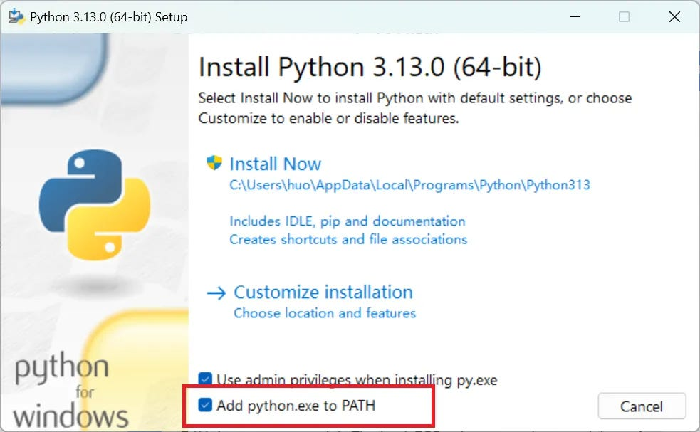

# Setting Environment
 ## python version 
`python 3.13`
 ## Modules
`pandas`\
`numpy`\
`customtkinter`
 ## Install Method
 ### Installing python in windows
 #### 1.Select your installer
* [Windows 32-bit](https://www.python.org/ftp/python/3.13.9/python-3.13.9.exe)
* [Windows 64-bit](https://www.python.org/ftp/python/3.13.9/python-3.13.9-amd64.exe)
#### 2.Double click your installer to start installing

> [!WARNING]
> Admin to select `Add python.exe to PATH` while installing

#### 3.Install
Click `Install Now` and click `Next` untill finished

### Installing python modules in windows
#### 1.Open `powershell`
#### 2.Input `pip install <module name>`
#### 3.Install all of the modules that this program needs